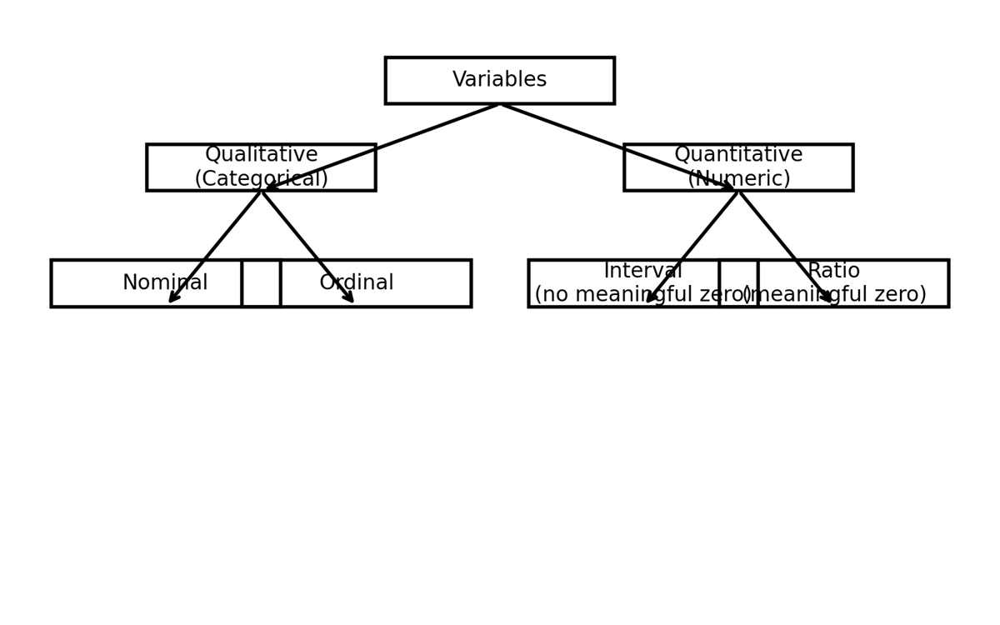
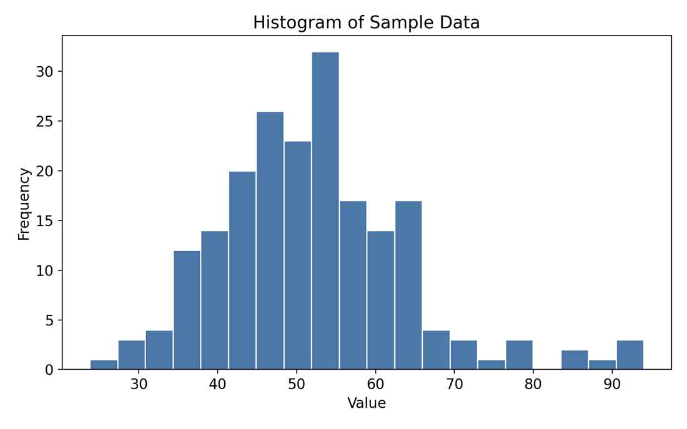
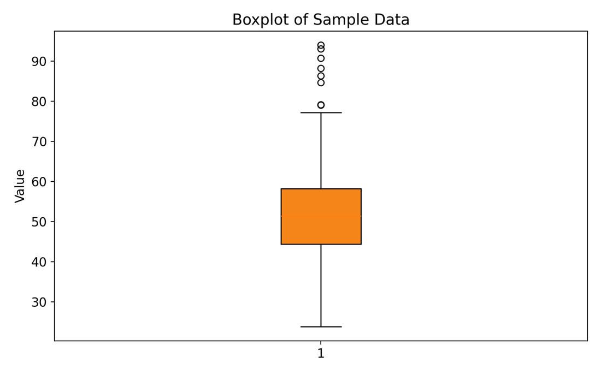
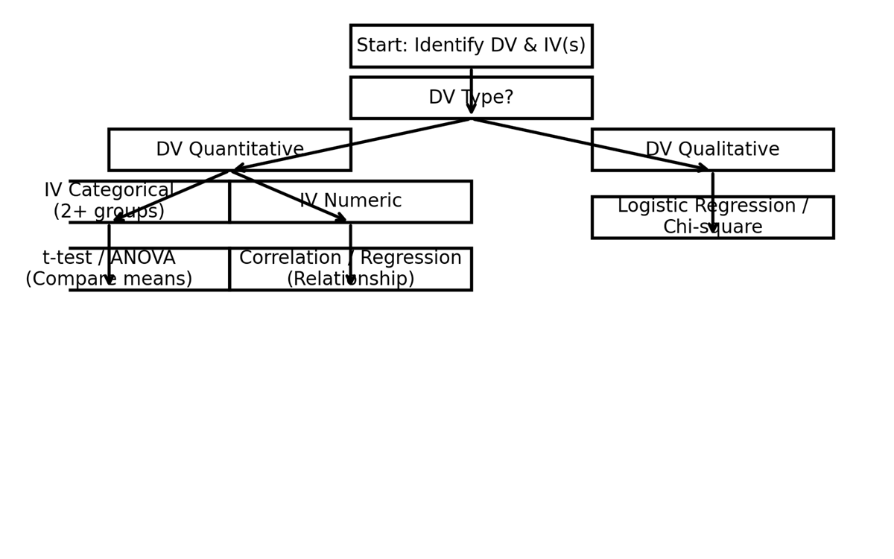

## Week 2
## Executive Summary: Variable Classification, Summary Statistics, and Inferential Decision Rules

### 1. Variable Classification
A variable must exhibit variation across cases. Classify variables first by type—Qualitative (Categorical) vs. Quantitative (Numeric)—and then by scale of measurement: Nominal, Ordinal, Interval, or Ratio. This classification guides appropriate statistical procedures.

**Examples:**
- Number of votes → Quantitative, Ratio (meaningful zero).
- Highest degree achieved → Qualitative, Ordinal.
- Men’s pants sizes → Quantitative, Ratio.
- Women’s jeans sizes → Qualitative, Ordinal (labels; inconsistent numeric steps).
- Language proficiency → Depends on measurement instrument (numeric test score vs. categorical level).

### 2. Summary Statistics

**Key measures and formulas (plain text):**
- Mean (arithmetic average): `x̄ = (1/n) * Σ(xᵢ)`
- Median: middle value when ordered; for even `n`, median = `(x_(n/2) + x_(n/2+1))/2`
- Sample variance: `s^2 = Σ(xᵢ - x̄)^2 / (n - 1)`
- Sample standard deviation: `s = √(s^2)`
- Population variance: `σ^2 = Σ(xᵢ - μ)^2 / n`
- Skewness (Fisher–Pearson): `g1 = m3 / s^3`, where `m3 = mean((x - x̄)^3)`
- Excess kurtosis (Fisher): `g2 = m4 / s^4 - 3`, where `m4 = mean((x - x̄)^4)`

#### Worked Example: Computing Summary Statistics and a 95% CI for the Mean
Given a sample (`n = 200`), we compute:
- Sample mean (`x̄`) = **52.144**
- Sample median = **51.411**
- Sample variance (`s^2`) = **145.968**
- Sample std. dev. (`s`) = **12.082**
- Skewness (`g1`) ≈ **0.827**
- Excess kurtosis (`g2`) ≈ **1.340**

**95% Confidence Interval for the mean (normal approximation):** `CI = x̄ ± z_(0.975) * SE(x̄)`, where `SE(x̄) = s/√n`, `z_(0.975) = 1.96`  
**Result:** `[50.470, 53.819]`

### 3. Inferential Statistics & Decision Rules
Summary vs. inference: Summary statistics describe a sample; inferential methods test hypotheses and estimate parameters to generalize to populations.

**Hypothesis Testing Framework:**
- `H0` (null): baseline claim (e.g., no difference).
- `H1` (alternative): competing claim.
- **Test statistic**: function of data; compare to reference distribution.
- **Decision rule**: Reject `H0` if *p*-value ≤ `α` or if test statistic exceeds critical value.

**Common procedures by scenario:**
- Two-group mean comparison (DV quantitative, IV categorical with 2 levels): **independent-samples t-test**.
- Multi-group mean comparison (DV quantitative, IV categorical with ≥3 levels): **ANOVA**.
- Association between two quantitative variables: **Pearson correlation**; **simple/multiple linear regression**.
- DV binary: **Logistic regression**; association between categorical variables: **Chi-square test**.

### Worked Example: Choosing a Test
Scenario: Compare average training scores (numeric) between two departments (categorical: A vs. B).  
Classification → **DV quantitative**, **IV categorical (2 levels)** ⇒ **independent-samples t-test**.  
Decision rule (`α = 0.05`): reject `H0` if `t > t_crit` or `p-value ≤ 0.05`.

#### 4. Practical Guidance
Focus on conceptual correctness: choose procedures that match variable type and scale. Deviations from standard heuristics can be justified if intentional and principled.

**Checklist:** confirm variables, identify scales, specify DV/IV, choose test via decision rules, inspect assumptions (normality, homoscedasticity, independence).
